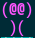
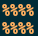
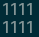
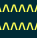
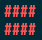

#INTRODUCTION
 This is a simple implementation of [Bomberman Game](http://www.retrogames.cz/play_085-NES.php?language=EN) on terminal.
Very lightweight and does not require bloated libraries like _PyGame_ or _ncurses_.

#GAME COMPONENTS
 * __BomberMan__
	

* __Enemy__
	

* __Brick__
	

* __Bomb__
	

* __Explosion__
	

* __Gate__
	

* __Wall__
	

#DETAILS
##Features
* 3 lives for each play.
* Gate to enter new levels and active only after destroying all enemies.
* Max Level upto 7.
* Explosion persists for some time interval.
* To make things worse for player the enemies move randomly.
* BomberMan can drop have most two bombs at a time.
* In each level Enemies move with some base speed with some randomness added to their base speeds.
* Time limit of 198 sec for each play.
* Score for killing an enemy or destroying a brick and even level bonus scores.
* Pause the Game in between for playing later.
* Bomb shows the timeout of explosion.
* Colors for nice user experience.
* Other basic features are also there.

##Controls
* `w` for north
* `a` for west
* `s` for south
* `d` for east
* `b` for dropping a bomb
* `p` for pause
* `q` for quit
* `<ENTER>` for resume

##CODE DESCRIPTION
###Board.py
This file contains the `Board` class. This is the class which has functions for rendering the board
and placing any object on the board.
###Bomb.py
This file contains the `Bomb` class. Each bomb is the object of this class. Each object maintains its
own timer for setting it off. The object handles the destruction caused by the bomb and its cleaning
up after the explosion effect is over.
###Person.py
`Person` class is the _super class_ of `Bomberman` and `Enemy`. It controls the movement of the aforementioned
objects by checking move validity.
###Bomberman.py
This file contains the `Bomberman` class which inherits its properties from `Person` class and checks
if the player is alive or not.
###Enemy.py
The `Enemy` class also inherits its properties from `Person` class. It defines its movement and creation.
###Game.py
This file contains the main script for running the Game. It is the starting execution point.
###Brick.py
This contains `Brick` class for defining bricks.
###Wall.py
This file has `Wall` class for defining walls.
###Constants.py
It contains various constants for defining game play options and display.
###Input.py
This file has logic for taking non-blocking input.
